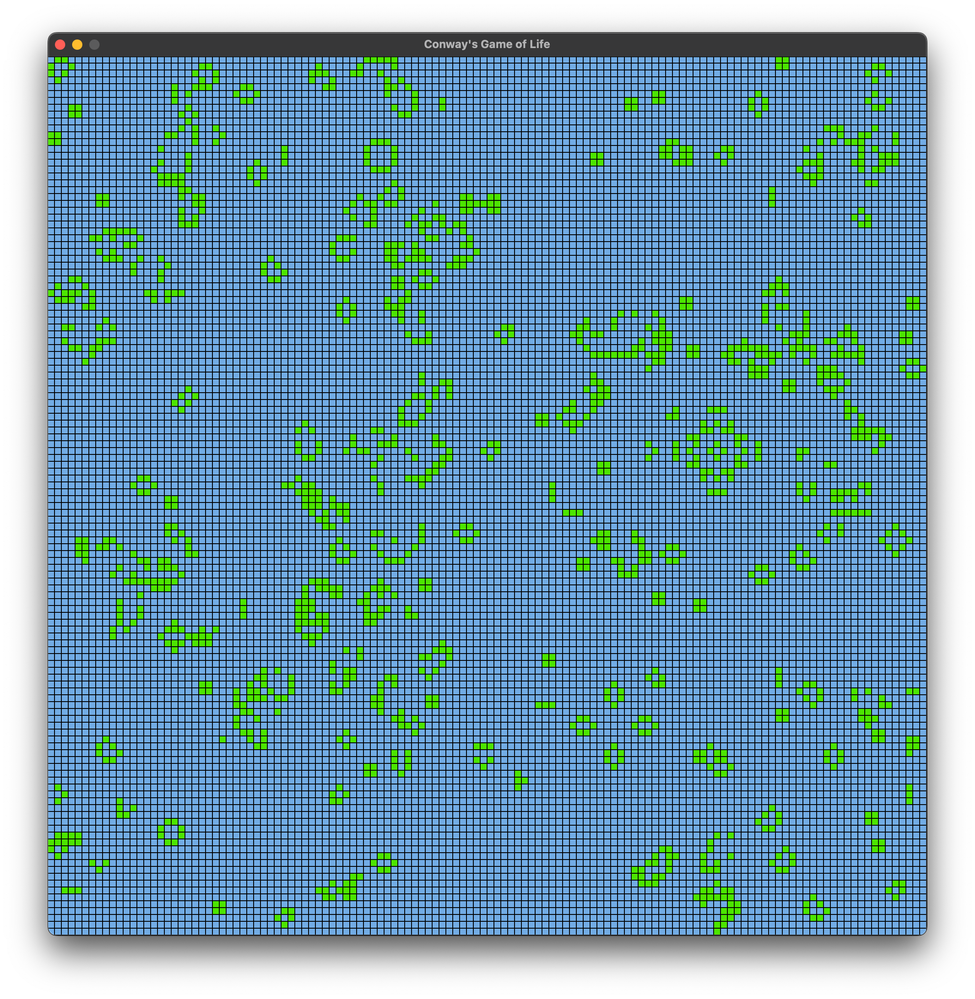

# GameOfLife
Learning RayLib with Conways game of life

Uses texture buffers to store the state of the cells and a fragment shader to compute the next state.

Runs at 20-40 FPS on my m4 MacBook Air, with a 16384x16384 grid.

